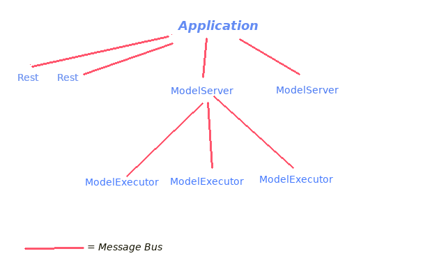

KOGITO-API-RESEARCH
===================

Main idea behind this implementation is to have a distributed/scalable system of model-executing instances.
See [original plan](https://docs.google.com/document/d/1JUTi4c2w_oASgU_kaxUDYdLfpAbN3DyQ05gFvomh-Ss/) for details

The grossly defined picture should be 

For each model definition there is a ModelExecutor.
ModelServer are Model-specific "gateway", i.e. each of them handle specific Model-type, and each of them "knows" a set of actual model definitions.
Every ModelServer has a List of "registered" Model executors.
ModelServer are responsible to listen from requests and activate the required model-executor if it is registered to itself, ignore otherwise.
It does not matter where such ModelServers are deployed, nor if the same model-executor is registered to multiple ModelServers: request will be managed only by the first answering ModelServer.

Every request coming from any Rest endpoint is routed to a shared message bus.
All ModelServers listen to the bus, then

1) if the request is for a different model type, the ModelServer ignores it
2) if the request is for the same model type, but the actual model is unknown, the ModelServer reply with a "Model not found" message
3) if the request is for the same model type, and the actual model is registered with the ModelServer, the ModelServer:
   a) reply with a "Model found" message
   b) "activate" the specific model executor
4) if no "Model found" message is received, then the Rest endpoint will return a failed execution notification
5) if a "Model found" message is received, then the Rest endpoint will wait and return (asynchronously) the evaluated result

Model executor activation means:
    1) tell the model executor to register to the bus
    2) forward the request data to the model executor

The model executor will unregister itself after computation is done

The above structure will be implemented for both Quarkus and Springboot environments

Current status
--------------

The design description leads to the following observations, constraints and choices

1) there are roughly three main "concepts": MessageBus, ModelServer, ModelExecutor
2) for each of such concepts there is a some shared code and some specific one
3) for MessageBus and ModelServer, the specific code depends on the environment (Quarkus vs Springboot)
4) for ModelExecutor, the specific code depends on the model type

The above naming convention has been used for sake of understanding. Current status (POC WIP) uses different naming, notably

1) ModelServer -> ServerMain

